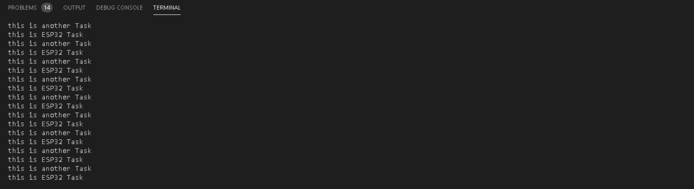

# PRACTICA 4  : SISTEMAS OPERATIVOS EN TIEMPO REAL

## A: EJERCICIO 1

### Código

```cpp
#include <Arduino.h>


void anotherTask( void * parameter);

void setup(){

Serial.begin(9600);
/* we create a new task here */
xTaskCreate(
anotherTask, /* Task function. */
"another Task", /* name of task. */
10000, /* Stack size of task */
NULL, /* parameter of the task */
1, /* priority of the task */
NULL); /* Task handle to keep track of created task */

}

/* the forever loop() function is invoked by Arduino ESP32 loopTask */

void loop()
{
Serial.println("this is ESP32 Task");
delay(1000);
}

/* this function will be invoked when additionalTask was created */
void anotherTask( void * parameter )
{
/* loop forever */
for(;;){
Serial.println("this is another Task");
delay(500);
}

/* delete a task when finish,
this will never happen because this is infinity loop */
vTaskDelete( NULL );

}
```

### Funcionamiento del programa

El objetivo principal de este programa es crear una tarea que llamada anotherTask la cual se va a ejecutar en paralelo con el loop del main. 

Tenemos una función Setup que crea nuestra tarea usando "xTaskCreate", a nuestra tarea le tendremos que atribuir un nombre, el tamaño del stack, el parámetro de la tarea y su prioridad.

```cpp
void setup(){

Serial.begin(9600);
/* we create a new task here */
xTaskCreate(
anotherTask, /* Task function. */
"another Task", /* name of task. */
10000, /* Stack size of task */
NULL, /* parameter of the task */
1, /* priority of the task */
NULL); /* Task handle to keep track of created task */

}
```

En segundo lugar, creamos un Loop con el objetivo de crear un bucle donde se muestra por pantalla "this is ESP32 Task" cada segundo.

```cpp
void loop()
{
Serial.println("this is ESP32 Task");
delay(1000);
}
```

Finalmente llamamos a la función "anotherTask" declarada anteriormente y definimos en ella otro bucle que  muestre por pantalla "this is another Task" cada segundo. Después con la función "vTaskDelete" eliminamos la tarea cuando esta acabe.

```cpp
void anotherTask( void * parameter )
{
/* loop forever */
for(;;){
Serial.println("this is another Task");
delay(500);
}

/* delete a task when finish,
this will never happen because this is infinity loop */
vTaskDelete( NULL );

}
```

### Salida por el Terminal

Esto es lo que se observa a la salida del puerto serie:


